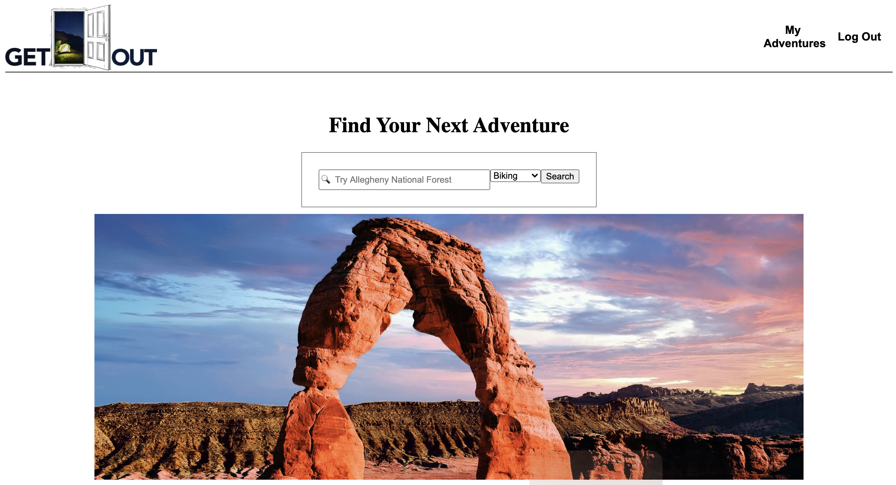
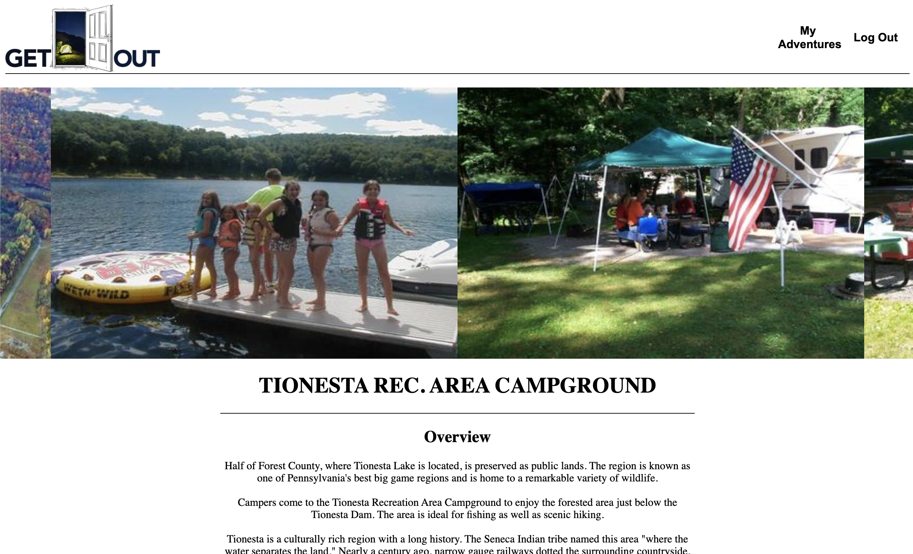
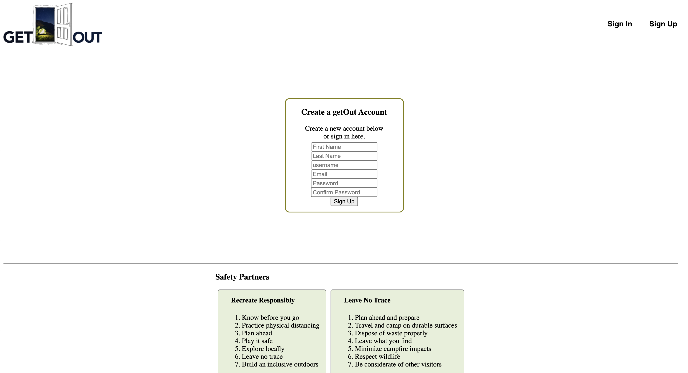

# getOut
getOut is an outdoor app. It helps users find places to go camp, hike or bike.

## Screenshots

## Features
* Search for sights
* add and delete wishlist
* Campsite Info
* add and delete Trips

## Database
https://drawsql.app/getout/diagrams/getout#

## Routes
API used Recreation.gov

### API Endpoints
1. Blueprint: 'users', url_prefix = "/api/users"
    * GET /:id - Get all user info
    * POST / - Create new user
    * PUT /:id - Edit user info
    * DELETE /:id - Delete user
2. Blueprint: 'trips', url_prefix = "/api/trips"
    * GET / - get all trips
    * GET /:id - get one trip
    * PUT /:id - edit one trip
    * POST / - post a new trip
    * DELETE /:id - delete one trip
3. Blueprint: 'sites', url_prefix = "/api/sites"
    * GET / - get all sites
    * GET /:id - get singular site

## Technologies Used
* React.js
* PostgreSQL
* Docker
* Heroku
* React Datepicker
* Flask